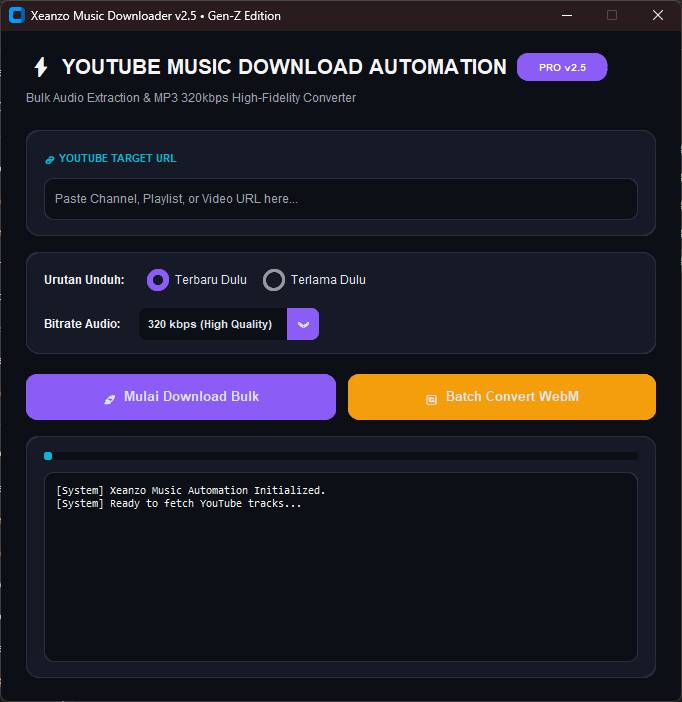

<div align="center">

  # ⚡ XEANZO MUSIC AUTOMATION DOWNLOADER

  <p align="center">
    <b>A Modern, Ultra-Fast, Bulk YouTube Audio Extraction & High-Fidelity MP3 Converter Desktop Application</b>
  </p>

  <!-- BADGES SECTION -->
  <p align="center">
    <a href="https://github.com/xeanzo/Youtube-Music-Downloader">
      
    </a>
    <a href="https://github.com/xeanzo/Youtube-Music-Downloader">
      
    </a>
    <a href="https://github.com/xeanzo/Youtube-Music-Downloader">
      
    </a>
    <a href="https://github.com/xeanzo/Youtube-Music-Downloader">
      
    </a>
  </p>

  <br>

  <!-- APP PREVIEW SCREENSHOT -->
  <a href="https://github.com/xeanzo/Youtube-Music-Downloader">
    
  </a>

  <br>
  <sub><i>UI Preview — Dark Obsidian Aesthetics with Poppins Typography & Electric Violet Theme</i></sub>

</div>

---

## 🌟 Overview

**Xeanzo YouTube Music Automation Downloader** is a lightweight, cross-platform desktop application designed to solve the hassle of manually downloading audio and remix tracks from YouTube. Powered by **yt-dlp** and wrapped in a sleek **CustomTkinter (Gen-Z Dark Aesthetics)** interface, it allows users to bulk-extract complete channels or playlists directly into crystal-clear **MP3 320kbps** with full metadata tagging.

---

## ✨ Key Features & Highlights

| Feature | Description |
| :--- | :--- |
| **🎨 Gen-Z Dark Aesthetics** | Modern Glassmorphism card UI built with `CustomTkinter` featuring Poppins typography & status badges. |
| **🔊 High-Fidelity MP3 Extraction** | Automatically converts YouTube streams to **320 kbps MP3** with embedded ID3 tags and album cover art. |
| **🔗 Smart URL Normalization** | Auto-corrects channel links (appending `/videos`) to prevent extraction failures. |
| **🛡️ Anti-Duplicate History Logger** | Maintains an internal registry (`downloaded_history.txt`) to skip previously fetched tracks during updates. |
| **🔄 Batch Offline Converter** | Built-in multithreaded FFmpeg wrapper to convert local `.webm` files to `.mp3` without bandwidth cost. |
| **⚡ Multi-Bitrate Selector** | Choose between 320 kbps (High Quality), 192 kbps (Standard), or 128 kbps (Compact). |
| **⏳ Sequence Order Options** | Flexible sorting to process downloads starting from either the **Newest** or **Oldest** upload. |

---

## 🛠️ Prerequisites

Before running the application, ensure you have the following installed on your system:

1. **Python 3.10 or higher**
2. **FFmpeg** (Required for audio post-processing & MP3 encoding)
   ```powershell
   winget install FFmpeg


🚀 Quick Setup & Installation
1. Clone the Repository
Bash
git clone [https://github.com/xeanzo/Youtube-Music-Downloader.git](https://github.com/xeanzo/Youtube-Music-Downloader.git)
cd Youtube-Music-Downloader
2. Install Python Dependencies
Bash
pip install customtkinter yt-dlp
3. Launch the Application
Method A (One-Click Launcher for Windows):
Double-click run.bat (runs silently in background without CMD window).

Method B (Terminal Execution):

Bash
python app_gui.py
📂 Project Architecture
Plaintext
Youtube-Music-Downloader/
├── app_gui.py             # Main Desktop GUI Source Code
├── run.bat                # Windows Background Launcher Script
├── preview.png            # Application Screenshot Preview
├── .gitignore             # Git Ignore Rules
├── Downloads/             # Default Output Directory for Audio Files
│   └── downloaded_history.txt  # Anti-Duplicate Record File
└── README.md              # Project Documentation
👤 Author & Branding
Gigih Jean Fariellana (Xeanzo)

🐙 GitHub: @xeanzo

⚙️ CAD & Digital Manufacturing: Yanz3D Portfolio